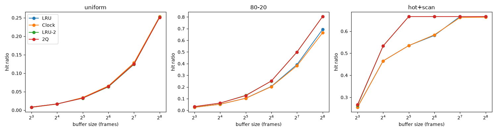

# Lab 2 — Buffer Pool, Row vs Column Storage, Page Encryption

This lab does **not** use PostgreSQL. It builds a tiny storage engine in Python:
pages are 4 KB blocks inside plain files (`*.db`) that the scripts create and delete
themselves, filled with generated data (random page requests, 200,000 fake students).

| File | What it is |
|---|---|
| `disk_manager.py` | Reads/writes 4 KB pages in a file, counts disk reads/writes |
| `replacers.py` | Replacement policies: LRU, Clock, LRU-K (K=2), 2Q |
| `buffer_pool.py` | Buffer pool manager: page table, pin count, dirty flag, hit/miss |
| `row_store.py` | Row-oriented storage (NSM) |
| `column_store.py` | Column-oriented storage (DSM) + `convert_row_to_column` |
| `crypto_disk.py` | Disk manager that encrypts each page with AES-256-GCM |
| `test_buffer.py` | Sanity checks for the buffer pool and every replacer |
| `bench_buffer.py` | Hit ratio per policy × buffer size × workload |
| `bench_storage.py` | Row vs column: `AVG(gpa)` and point lookups |
| `bench_encryption.py` | Plain vs encrypted storage per buffer size |

## Run (Windows PowerShell)

From the repository root, activate the course environment and install the new packages once:

```powershell
.\.venv\Scripts\Activate.ps1
pip install -r requirements.txt
```

Then run each step from the lab folder:

```powershell
cd labs\lab02
python test_buffer.py
python bench_buffer.py
python bench_storage.py
python crypto_disk.py
python bench_encryption.py
```

## Results

Numbers below are from one run; timings change from machine to machine, page counts do not.

### 1. Replacement policies (`bench_buffer.py`)

1000 pages, 20,000 requests, same trace for every policy.



| hot+scan | LRU | Clock | LRU-2 | 2Q |
|---|---|---|---|---|
| 16 frames | 46.5% | 46.5% | 53.3% | 53.3% |
| 32 frames | 53.5% | 53.5% | 66.6% | 66.6% |
| 64 frames | 58.1% | 58.4% | 66.6% | 66.6% |

- **uniform**: all policies are equal; hit ratio ≈ buffer size / number of pages. No policy can
  predict random requests.
- **80-20**: LRU-2 and 2Q win (e.g. 50% vs 39% at 128 frames) because they keep pages that were
  requested more than once.
- **hot+scan**: LRU and Clock suffer from *sequential flooding* — scan pages that are read only
  once push the hot pages out. LRU-2 treats one-time pages as infinite distance, and 2Q keeps them
  in the A1 queue, so the hot set survives. Once the buffer is large enough to hold hot set + scan
  (128+ frames) all policies converge.
- Clock ≈ LRU everywhere: it is a cheaper approximation of LRU.

### 2. Row vs column storage (`bench_storage.py`)

200,000 rows `(id int, name char(20), gpa float)`, cold 64-frame buffer before each query.

| Query | Row (NSM) | Column (DSM) |
|---|---|---|
| `AVG(gpa)` page reads | 1370 | **196** |
| 1000 random full-row lookups, page reads | **946** | 2757 |
| Total pages | 1370 | 1373 (id 196, name 981, gpa 196) |

- A row is 28 bytes → 146 rows per page. The `gpa` column alone is 4 bytes → 1023 values per page,
  so the aggregate reads ~7× fewer pages in the column store (OLAP).
- A full-row lookup needs one page in the row store but one page **per column** in the column
  store (tuple reconstruction), ~3× more reads (OLTP favours rows).
- Total size is almost the same: without compression, splitting by column only moves bytes around.

### 3. Encrypted vs plain pages (`bench_encryption.py`)

80-20 workload, 30% writes, LRU. Each on-disk page grows by 28 bytes (12-byte nonce + 16-byte tag).

| Buffer | Hit ratio | Plain (s) | Encrypted (s) | Overhead |
|---|---|---|---|---|
| 8 | 2.5% | 0.424 | 0.580 | 37% |
| 32 | 10.1% | 0.382 | 0.457 | 19% |
| 128 | 38.9% | 0.291 | 0.362 | 25% |
| 512 | 86.6% | 0.087 | 0.100 | 15% |

- Encryption/decryption only happens on a miss (read) or when a dirty page is written back.
  Pages in the buffer pool stay plaintext, so the higher the hit ratio, the less the encryption
  cost matters.
- AES-GCM also authenticates: `crypto_disk.py` shows that flipping one byte, or copying page 1 into
  page 0's slot (the page id is used as associated data), is rejected with `InvalidTag`.
- The OS file cache makes "disk" reads here much faster than a real disk, which makes the
  relative encryption overhead look larger than in a real database. Timings are noisy; run a few
  times.
