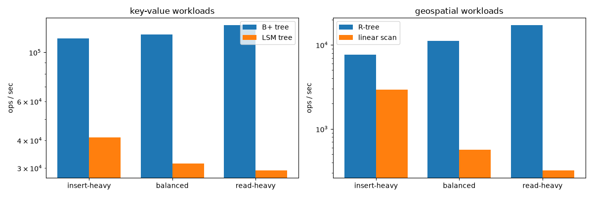

# Lab 4 — Index Structures: B+ Tree, LSM Tree, R-Tree

This lab does **not** use PostgreSQL. It builds three index structures in plain Python and
compares them under insert-heavy and read-heavy workloads.

| File | What it is |
|---|---|
| `bplus_tree.py` | Concurrent B+ tree (latch crabbing) with bulk loading |
| `lsm_tree.py` | LSM tree: memtable, SSTable files with Bloom filter + sparse index, compaction |
| `rtree.py` | R-tree for 2-D data: window queries and k-nearest-neighbour search |
| `test_indexes.py` | Sanity checks: every structure is compared with a simple, obviously correct model |
| `bench_indexes.py` | The benchmark: prints the tables below and saves `index_bench.png` |

## Run (Windows PowerShell)

From the repository root, activate the course environment:

```powershell
.\.venv\Scripts\Activate.ps1
```

Then run from the lab folder:

```powershell
cd labs\lab04
python test_indexes.py
python bench_indexes.py
```

The tests take about 15 seconds and the benchmark about 2.5 minutes. The LSM tree writes its
SSTable files to a temporary folder (`bench_lsm/`, `test_lsm/`) and deletes it at the end.

## 1. Concurrent B+ tree (`bplus_tree.py`)

**The structure.** Internal nodes hold only keys and child pointers and are used to find the way
down. All values live in the leaves, and every leaf points to its right sibling, so a range scan
finds the first leaf and then just walks sideways. `order` is the maximum number of children of
an internal node; a node holds at most `order - 1` keys.

**Insert and split.** A key is inserted into its leaf. If the leaf now has too many keys it is
split in half, and the first key of the new right half is *copied* up to the parent as a
separator. If the parent overflows too it splits the same way, except that its middle key is
*pushed* up (removed from the node). If the root splits, a new root is created — this is the
only way the tree gets taller, which is why all leaves are always at the same depth.

**Concurrency: latch crabbing.** Every node has a reader/writer latch (`RWLatch`: many readers
or one writer). A thread moves down the tree like a crab: it latches the child first and only
then releases the parent, so no other thread can change the path under it.

- `search` and `range_scan` take read latches all the way down. A range scan latches the next
  leaf before releasing the current one.
- `insert` is **optimistic** first: it takes read latches down to the leaf and a write latch
  only on the leaf. Most inserts fit in the leaf, so the upper levels are never blocked.
- If the leaf is full, the insert restarts in **pessimistic** mode: write latches from the root
  down, and all ancestors are released as soon as a node is *safe* (it has a free slot, so a
  split below cannot travel past it). Only the nodes that might really change stay latched.
- A separate small lock protects the root pointer, because a root split replaces the root.

There are no deadlocks because every thread acquires latches in the same direction: top to
bottom, and left to right along the leaves.

**Bulk loading.** Inserting N keys one by one costs N root-to-leaf descents and many splits.
If the data is already sorted, `bulk_load` builds the tree bottom-up instead: cut the sorted
input into leaves filled to `fill` (default 90%), link them, then build each parent level from
the smallest key of every child until one node is left — the root. No searching, no splits.

**Delete** removes the key from its leaf but does not merge underfull leaves (lazy delete).

## 2. LSM tree (`lsm_tree.py`)

A B+ tree updates pages in place, so on disk every insert is a random page write. An LSM tree
never updates in place; it only appends new sorted files and cleans up later.

- **Memtable.** Writes go to an in-memory dictionary. Nothing touches the disk.
- **Flush → SSTable.** When the memtable reaches `memtable_limit` entries (4096), it is sorted
  and written to disk in one sequential pass as an immutable *SSTable* (sorted string table).
- **Delete = tombstone.** Files are immutable, so a delete writes a special marker that hides
  older versions of the key.
- **Read path.** Check the memtable, then the SSTables from newest to oldest, and stop at the
  first version found. Two things make this cheaper:
  - a **Bloom filter** per SSTable answers "definitely not in this file" from memory, so most
    files are skipped without reading them;
  - a **sparse index** (one entry per 32 records) says which block of the file to read, so a
    lookup reads one small block instead of the whole file.
- **Compaction (size-tiered).** Without cleanup the number of files — and so the read cost —
  grows forever. When a level collects `fanout` (4) tables, they are merged with a k-way merge
  into one bigger table in the next level. For duplicate keys only the newest version is kept.
  Tombstones are dropped only when merging into the bottom level, because higher up an older
  file might still contain the key.

**The trade-off.** Writes are cheap and sequential, but each record is rewritten several times
by compaction (*write amplification*), and a read may have to look in several files
(*read amplification*).

## 3. R-tree (`rtree.py`)

A B+ tree needs a total order on the keys, and 2-D points have none: sorting by longitude says
nothing about latitude. An R-tree groups nearby objects into *minimum bounding rectangles*
(MBRs). A leaf holds objects; an internal entry holds the MBR that covers everything below it.
MBRs of siblings may overlap.

- **Insert.** At each level go into the child whose MBR needs the *least enlargement* to cover
  the new object, add it to a leaf, then update the MBRs on the way back up.
- **Split (Guttman's quadratic split).** When a node has more than `max_entries` (16) entries:
  pick as seeds the two entries that would waste the most area if they stayed together, then
  assign the remaining entries one by one to the group that grows less.
- **Window query** (`search`). Go down only into children whose MBR intersects the query
  rectangle. Whole subtrees are skipped with one comparison.
- **k nearest neighbours** (`nearest`). Best-first search with a priority queue ordered by the
  minimum possible distance from the query point to each MBR. The first k objects that come out
  of the queue are the answer.

Rectangles are `(xmin, ymin, xmax, ymax)` with x = longitude and y = latitude; a point is a
rectangle with zero area. Distances are plain Euclidean distances in degrees.

## Results

Numbers are from one run. Each timing is the best of 3 runs on a freshly built structure;
absolute speeds change from machine to machine, the counts (height, leaves, tables) do not.



### 1. Building the B+ tree

100,000 keys, order 64.

| Method | Time (s) | Height | Leaves | Leaf fill |
|---|---|---|---|---|
| insert, random order | 0.846 | 3 | 2241 | 71% |
| insert, sorted order | 0.811 | 4 | 3125 | 51% |
| bulk load (fill 0.9) | 0.021 | 3 | 1786 | 89% |
| bulk load (fill 1.0) | 0.019 | 3 | 1588 | 100% |

- Bulk loading is about **40× faster** than inserting one by one.
- Random inserts leave the leaves about 70% full. Sorted inserts are the worst case: every split
  leaves behind a half-full leaf that never receives another key, so the leaves end at 51% and
  the tree is one level taller.
- Bulk loading lets you choose the fill. 100% gives the smallest tree but the first insert into
  any leaf causes a split; 90% leaves some room for later inserts.

### 2. B+ tree vs LSM tree

100,000 keys loaded, then 100,000 operations (same trace for both). Operations per second:

| Workload | B+ tree | LSM tree | LSM state at the end |
|---|---|---|---|
| insert-heavy (90% insert) | 115,336 | 41,204 | 7 tables / 3 levels, write amp 2.6× |
| balanced (50% insert) | 120,546 | 31,402 | 3 tables / 3 levels, write amp 2.8× |
| read-heavy (10% insert) | 132,693 | 29,242 | 5 tables / 3 levels, write amp 2.5× |

- **Trends match the theory.** The B+ tree gets faster as the share of reads grows (a read is one
  descent with no splits). The LSM tree gets *slower* as reads grow: an insert is just a
  dictionary write, but a read has to check the memtable and then several files.
- **The B+ tree wins every row, including insert-heavy — and this comparison is not fair.**
  This B+ tree lives entirely in memory and never writes to disk, while the LSM tree really
  writes and merges files. The advantage of an LSM tree is in disk I/O, which the B+ tree here
  does not pay at all.
- **What the I/O would look like.** The LSM tree wrote about **63 bytes per insert**, all
  sequential (a ~24-byte record, rewritten 2.6 times by compaction). An on-disk B+ tree has to
  rewrite the whole leaf page for every insert: one **random 4 KB page write**, about 65× more
  bytes, unless a buffer pool batches them. That is the reason write-heavy systems (RocksDB,
  Cassandra) use LSM trees, and it is not visible when the B+ tree is in RAM.
- **Write amplification 2.5–2.8×** is the price of compaction: each record is written once at
  flush and again every time it moves down a level.

### 3. B+ tree with several threads

100,000 operations split over T threads. Operations per second:

| Threads | insert-heavy | balanced | read-heavy |
|---|---|---|---|
| 1 | 118,965 | 124,396 | 130,556 |
| 2 | 111,855 | 118,280 | 124,545 |
| 4 | 117,808 | 122,184 | 131,883 |
| 8 | 116,393 | 118,597 | 128,251 |

- Throughput stays flat. Python's global interpreter lock (GIL) lets only one thread run Python
  code at a time, so more threads cannot give more speed here.
- What this lab shows is **correctness**: `test_indexes.py` runs 8 writers and 4 readers at the
  same time and checks that no insert is lost, no reader sees a broken node, and the tree is
  still a valid B+ tree at the end. In a language without a GIL, the same latching protocol is
  what lets readers and writers in different parts of the tree run in parallel.

### 4. R-tree vs linear scan

20,000 random points (longitude 25–35, latitude 22–32) loaded, then 2,000 operations. A query
is a 0.2° × 0.2° window. The baseline is a plain list that is scanned completely for each query.

| Workload | R-tree | Linear scan | R-tree nodes visited per query |
|---|---|---|---|
| insert-heavy (90% insert) | 7,634 | 2,950 | 14.0 |
| balanced (50% insert) | 11,146 | 563 | 9.7 |
| read-heavy (10% insert) | 17,150 | 321 | 11.2 |

- A window query visits about 10–14 nodes of a height-4 tree instead of comparing against all
  20,000+ points, so the R-tree is **53× faster** on the read-heavy workload.
- Inserts are where the R-tree pays: appending to a list is free, while an R-tree insert has to
  choose a subtree at every level and sometimes split. With 90% inserts the R-tree is only 2.6×
  ahead, and with 100% inserts the list would win.
- Same lesson as the other two structures: an index makes reads faster by doing extra work on
  every write.

## Summary

| | Good at | Pays with |
|---|---|---|
| B+ tree | point lookups and range scans, stable read cost | random page writes, splits |
| LSM tree | high insert rates, sequential disk writes | slower reads, compaction (write amplification) |
| R-tree | 2-D window and nearest-neighbour queries | expensive inserts, overlapping rectangles |

## Simplifications

- The B+ tree is in memory only (no pages on disk) and `delete` does not merge nodes.
- The LSM tree has no write-ahead log, so the memtable is lost on a crash; it does not reload
  existing SSTables on start; one lock protects the whole tree; compaction runs in the
  foreground inside `put`.
- The R-tree is not thread-safe, has no delete, and uses flat Euclidean distance instead of
  real distance on the Earth's surface.
